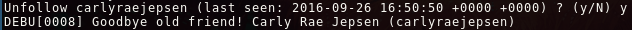

# twitter-cleaner

A small thing to check who you follow on Twitter, and it they are alive. Also, it can unfollow dead people.



(Of course, you don't want to unfollow her)[.](https://www.youtube.com/watch?v=b1LNQBX8JwE)

```
go get -u gitlab.com/SiegfriedEhret/twitter-cleaner/...
```

## Usage

You need to [create a Twitter app](https://apps.twitter.com/).

```
$ twitter-cleaner -h
twitter-cleaner v1.0.0
  -accessToken string
    	Your access token
  -accessTokenSecret string
    	Your access token secret
  -age int
    	How many days since last tweet ? (default 61)
  -consumerKey string
    	Your consumer key
  -consumerSecret string
    	Your consumer secret
  -d	Run in debug mode

```